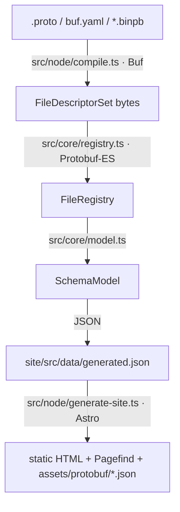

# AGENTS.md

Guidance for coding agents working in this repository. Human-facing product docs live in `README.md`.

## What this is

pbschema-lens is a **static** Protocol Buffers schema explorer. Buf (or a prebuilt `FileDescriptorSet`) compiles the schema. This repo builds a renderer-independent symbol model with Protobuf-ES, then emits an Astro static site. There is no documentation server, database, or schema registry.

Do not introduce Starlight, MDX, or a runtime docs server. Pages come from `getStaticPaths()` over the symbol model, not markdown files.

## Layout

| Path | Role |
|---|---|
| `src/cli.ts` | CLI (`build`, `dev`, `doctor`, `diff`, `init`) |
| `src/core/` | Descriptor model, URLs, comments, search, option renderers |
| `src/node/` | Config, Buf compile, site generation, GitHub Pages init template |
| `site/` | Astro UI. Imports the model via `pbschema-lens/core` |
| `examples/acme/` | Bundled demo schema; published to GitHub Pages |
| `examples/github-pages/` | Notes for *other* schema repos using this tool |
| `fixtures/` | Proto fixtures for tests |

During development, run the CLI with `npx tsx src/cli.ts …`, not a globally installed `pbschema-lens`.

## Internal architecture

Data flows one way. Do not add a reverse path from `site/` into Buf or the descriptor set.



`src/cli.ts` loads `pbschema-lens.yaml` (`src/node/config.ts`) and calls `buildDocumentation` in `src/node/pipeline.ts`. That is the only orchestration entry point for `build`, `dev`, and `diff`.

### Compile

`compileInput` accepts a Buf module/workspace, a directory of `.proto` files, or a `FileDescriptorSet`. A bare proto directory is wrapped in a temporary `buf.yaml` so compilation always goes through Buf. Descriptor-only inputs skip Buf and have no source text for the in-site browser.

### Model (`src/core/`)

`SchemaModel` (`src/core/types.ts`) is the contract between the Node pipeline and the Astro UI. Every documented entity is a `DocSymbol` in `model.symbols`, with kind-specific lists (`messages`, `services`, …) as indexes into that map.

`buildModel`:

1. Classifies each file (`src/core/classify.ts`) as `local`, `well-known`, `external-documented`, or `external-undocumented`. Only `local` and (non-hidden) WKT get pages / nav.
2. Walks the Protobuf-ES registry into packages, files, messages, fields, oneofs, enums, services, methods, and extensions.
3. Extracts custom options generically (`src/core/options.ts`). Semantic renderers in `src/core/plugins.ts` are optional overlays.
4. Sanitizes comments to HTML (`src/core/markdown.ts`).
5. Records forward edges and inverts them to `referencedBy` (`src/core/references.ts`).
6. Builds `symbolIndex` for client-side search (`src/core/search.ts`). URL grammar is `src/core/urls.ts`.

`--against` compiles a second schema, attaches `model.diff` (`src/core/diff.ts`), and may run `buf breaking` (`src/node/breaking.ts`).

User plugins listed in config are trusted Node modules loaded in `pipeline.ts`. They merge with `builtinPlugins`.

### Site (`site/`)

`generateSite` writes `SchemaModel` to `site/src/data/generated.json`, sets `PBSCHEMA_LENS_BASE` / `PBSCHEMA_LENS_OUT`, and runs `astro build --root site`. Astro pages under `site/src/pages/` call `loadModel()` and `getStaticPaths()`; they must not fetch the network or recompile protos.

After HTML is emitted, Pagefind indexes `data-pagefind-body` for full-text search. The header search box uses `assets/protobuf/symbols.json` (exact/prefix/fuzzy) and Pagefind as a second layer. The playground parses a descriptor set entirely in the browser.

### Where to change what

| Change | Place |
|---|---|
| CLI flags, commands | `src/cli.ts` |
| Config schema | `src/node/config.ts` |
| Buf / descriptor ingest | `src/node/compile.ts` |
| Symbol graph, comments, options | `src/core/` (`types.ts` first if the JSON shape changes) |
| HTTP / validation / field-behavior chips | `src/core/plugins.ts` |
| Page layout, tables, source browser | `site/src/` |
| Example schema | `examples/acme/proto/` |
| Pages workflow template | `src/node/init.ts` |

If you change `SchemaModel`, update both `src/core/` producers and `site/` consumers. The JSON dump is the API between them.

## Commands

```bash
npm ci
npm test
npx tsc -p tsconfig.json --noEmit
npx tsx src/cli.ts doctor examples/acme
npx tsx src/cli.ts build examples/acme --out examples/acme/dist
```

`site/tsconfig.json` is separate from the root `tsconfig.json` (which excludes `site/` and tests).

## Generated output — do not commit

These are gitignored and rewritten on every build:

- `dist/`, `site/dist/`, `examples/acme/dist/`
- `site/src/data/generated.json`, `site/src/data/generated-diff.json`
- `.astro/`, `.pbschema-lens/`

The Pages workflow for *this* repo builds `examples/acme` into `dist/` with `--base "/pbschema-lens/"`. Do not commit that output.

## Invariants

- **Comments are untrusted.** Render Markdown through the sanitized HTML allowlist in `src/core/markdown.ts`. Never compile proto comments as MDX or JavaScript. Tests in `src/core/markdown.test.ts` guard this.
- **Custom options are data, not a hard-coded name list.** Prefer the generic option model; semantic renderers in `src/core/plugins.ts` are additive sugar (`google.api.http`, validation, field behavior, deprecated).
- **View source** is the in-site proto browser when `.proto` text is available. `source.repository` only adds a separate “View on GitHub” link.
- **Plugins are trusted build code.** Do not load plugin modules from schema comments or other untrusted input.
- Reject source/output paths that contain `..`.

## GitHub Pages `base`

`base` is the site path, not the hostname:

| Publish mode | Typical URL | `base` |
|---|---|---|
| Public project site | `https://<owner>.github.io/<repo>/` | `/<repo>/` |
| Privately published site | unique `https://<random>.pages.github.io/` | `/` |
| User/org site or custom domain | origin root | `/` |

`pbschema-lens init --github-pages` writes `.github/workflows/protobuf-docs.yml` from the string in `src/node/init.ts`. If you change that workflow, edit `init.ts`, not a checked-in copy. Keep `examples/github-pages/README.md` in sync.

This repository’s own CI is `.github/workflows/ci.yml`: test, typecheck, doctor, build the Acme example, then deploy Pages from `main` only.

## Tests

Vitest files: `src/model.test.ts`, `src/core/markdown.test.ts`. `npm test` runs `vitest run`. Add fixture-driven tests under `fixtures/` when the change is about descriptor/model behavior.

CI also typechecks and runs `doctor` plus an example site build. Prefer that a change still builds `examples/acme`.
