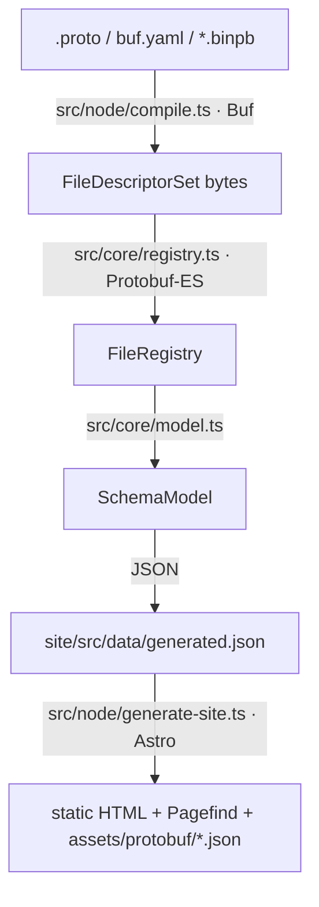

# AGENTS.md

Guidance for coding agents working in this repository. Human-facing product docs live in `README.md`. Every change follows the quality bar below.

## What this is

pbschema-lens is a **static** Protocol Buffers schema explorer. Buf (or a prebuilt `FileDescriptorSet`) compiles the schema. This repo builds a renderer-independent symbol model with Protobuf-ES, then emits an Astro static site. There is no documentation server, database, or schema registry.

Do not introduce Starlight, MDX, or a runtime docs server. Pages come from `getStaticPaths()` over the symbol model, not markdown files.

## Layout

| Path | Role |
|---|---|
| `src/cli.ts` | CLI (`build`, `dev`, `doctor`, `diff`, `init`) |
| `src/core/` | Descriptor model, URLs, comments, search, option renderers |
| `src/node/` | Config, Buf compile, site generation, GitHub Pages init template |
| `site/` | Astro UI. Imports the model via `pbschema-lens/core` |
| `examples/acme/` | Bundled demo schema; published to GitHub Pages |
| `examples/github-pages/` | Notes for *other* schema repos using this tool |
| `fixtures/` | Proto fixtures for tests |

During development, run the CLI with `npx tsx src/cli.ts …`, not a globally installed `pbschema-lens`.

## Internal architecture

Data flows one way. Do not add a reverse path from `site/` into Buf or the descriptor set.



`src/cli.ts` loads `pbschema-lens.yaml` (`src/node/config.ts`) and calls `buildDocumentation` in `src/node/pipeline.ts`. That is the only orchestration entry point for `build`, `dev`, and `diff`.

### Compile

`compileInput` accepts a Buf module/workspace, a directory of `.proto` files, or a `FileDescriptorSet`. A bare proto directory is wrapped in a temporary `buf.yaml` so compilation always goes through Buf. Descriptor-only inputs skip Buf and have no source text for the in-site browser.

### Model (`src/core/`)

`SchemaModel` (`src/core/types.ts`) is the contract between the Node pipeline and the Astro UI. Every documented entity is a `DocSymbol` in `model.symbols`, with kind-specific lists (`messages`, `services`, …) as indexes into that map.

`buildModel`:

1. Classifies each file (`src/core/classify.ts`) as `local`, `well-known`, `external-documented`, or `external-undocumented`. Only `local` and (non-hidden) WKT get pages / nav. `wellKnownTypes.enabled: false` keeps the well-known domain but sets `generatePage` and `inNav` false for every well-known file, including Timestamp and Duration. Hidden descriptor and feature protos stay unpublished when the flag is omitted or true.
2. Walks the Protobuf-ES registry into packages, files, messages, fields, oneofs, enums, services, methods, and extensions.
3. Extracts custom options generically (`src/core/options.ts`). Semantic renderers in `src/core/plugins.ts` are optional overlays.
4. Sanitizes comments to HTML (`src/core/markdown.ts`).
5. Records forward edges and inverts them to `referencedBy` (`src/core/references.ts`).
6. Builds `symbolIndex` for client-side search (`src/core/search.ts`). URL grammar is `src/core/urls.ts`.

`--against` compiles a second schema, attaches `model.diff` (`src/core/diff.ts`), and may run `buf breaking` (`src/node/breaking.ts`).

User plugins listed in config are trusted Node modules loaded in `pipeline.ts`. They merge with `builtinPlugins`.

### Site (`site/`)

`generateSite` writes `SchemaModel` to `site/src/data/generated.json`, sets `PBSCHEMA_LENS_BASE` / `PBSCHEMA_LENS_OUT`, and runs `astro build --root site`. Astro pages under `site/src/pages/` call `loadModel()` and `getStaticPaths()`; they must not fetch the network or recompile protos.

After HTML is emitted, Pagefind indexes `data-pagefind-body` for full-text search when `search.fullText` is omitted or true. The header search box always uses `assets/protobuf/symbols.json` (exact/prefix/fuzzy); that file is written on every build. Pagefind is the second layer.

### Where to change what

| Change | Place |
|---|---|
| CLI flags, commands | `src/cli.ts` |
| Config schema | `src/node/config.ts` |
| Buf / descriptor ingest | `src/node/compile.ts` |
| Symbol graph, comments, options | `src/core/` (`types.ts` first if the JSON shape changes) |
| HTTP / validation / field-behavior chips | `src/core/plugins.ts` (`google.api.http`, `buf.validate`, `cybozu.validate`, …) |
| Field table Validation column | `site/src/components/FieldTable.astro` (chips from `validation` / `cybozu.validate`) |
| Field table oneof grouping | `src/core/field-table.ts` + `site/src/components/FieldTable.astro` |
| Sidebar package tree and home area summary | `src/core/package-nav.ts` + `site/src/components/PackageTree.astro` + `site/src/pages/index.astro` |
| Source file tree | `src/core/source-tree.ts` + `site/src/components/SourceTree.astro` |
| RPC method pages | `src/core/urls.ts` + `site/src/pages/reference/methods/[name].astro` + `site/src/pages/reference/services/[name].astro` |
| Page layout, tables, source browser | `site/src/` |
| Example schema | `examples/acme/proto/` |
| Pages workflow template | `src/node/init.ts` |
| GitHub Release tarball | `.github/workflows/release.yml` on `main` version bumps (`scripts/release-detect.sh`) |

If you change `SchemaModel`, update both `src/core/` producers and `site/` consumers. The JSON dump is the API between them.

## Quality

This bar covers the whole product: the symbol model, the site, the CLI, config, fixtures, and any doc that specifies behavior. A config flag is one decision among others. Rendering, navigation, comments, options, URLs, search, diff, and the pipeline that joins them are held to the same bar.

### Expected quality

A change is finished when all of these hold:

1. The behavior lives in the layer that owns it (see Where to change what). `SchemaModel` is the contract between the pipeline and the site. The site projects that model. A model field nothing reads is unfinished. A page that invents a fact the model does not have is unfinished.
2. Removing the behavior makes `npm test` fail. The assertion states the required outcome. Pasting today's output into the test records the current code, including a bug, and the suite stays green.
3. The result still holds after every later pass. `buildModel` classifies, then links, then may publish, then builds the symbol index. An early decision that a later pass puts back is not done.
4. The invariants below still hold, and their tests still fail if the guard is removed. Comments stay sanitized HTML. Options stay data. Paths that contain `..` stay rejected. Plugins stay trusted build code, loaded only from config.
5. Root `tsc --noEmit` is clean. Generated files stay uncommitted (see the list below).
6. CI still passes: `npm test`, typecheck, `doctor`, the Acme site build, and `pack:smoke`. Those jobs guard the whole build. A green Acme build does not prove one decision, because the checked-in Acme config uses defaults and the happy path.

### How to maintain it

Pick the smallest test that goes red when the change is reverted. Size is a resource constraint, from the test pyramid (many small tests, fewer medium, few large) and from Google's small / medium / large sizes. Choose the row by what the test is allowed to touch, then write the test inside that limit.

| Size | Allowed resources | What it is for | Where it lives |
|---|---|---|---|
| Small | One process. No socket, no sleep, no subprocess, no site build. | One function: parse, classify, sanitize, build a URL, shape a nav or source tree, group a field table, render an option, rank a search hit, accept or reject a path. | `src/**/*.test.ts` next to that module |
| Medium | Disk and localhost. Compiling a fixture with Buf is medium. | The model after every pass, when a later pass can publish, link, or index something an earlier pass rejected. Loading yaml. Writing an artifact file. | `src/model.test.ts` and `fixtures/` |
| Large | `buildDocumentation`, a browser, or the packed tarball. | The rendered page or the install layout, and only when a smaller test cannot see the failure. | CI builds Acme and runs `pack:smoke` |

Call the production function. A test that reimplements the condition stays green when that function is never called. A test that only reads a config value back has the same hole.

Add a proto under `fixtures/` when the case is about descriptors. Third-party option protos (`google.api`, `buf.validate`, and the same kind of dependency) are Buf dependencies. Do not vendor a copy under `examples/` to feed a test.

When the change is layout, routing, or rendered data, also use the page in a browser. That check confirms the projection. The small or medium test is what locks the decision. Walking the default Acme home page does not cover a branch that page never takes.

When you fix a bug, add the test that failed on the old code in the same change. Start at small size. Step up a row only when the failure is invisible there. A bug in a pure function that is caught only by reading HTML means the suite is aimed at the wrong layer, and the next similar bug will ship.

`npm test` runs `vitest run`. The suite today is `src/model.test.ts`, `src/core/markdown.test.ts`, `src/core/field-table.test.ts`, `src/core/package-nav.test.ts`, `src/core/plugins.test.ts`, and `src/core/source-tree.test.ts`. `markdown.test.ts` is the pattern for an invariant: it calls `renderSafeMarkdown` and fails if a script tag survives. Add the next test at the size in the table.

## Commands

```bash
npm ci
npm test
npx tsc -p tsconfig.json --noEmit
npx tsx src/cli.ts doctor examples/acme
npx tsx src/cli.ts build examples/acme --out examples/acme/dist
```

`site/tsconfig.json` is separate from the root `tsconfig.json` (which excludes `site/` and tests).

## Generated output — do not commit

These are gitignored and rewritten on every build:

- `dist/`, `site/dist/`, `examples/acme/dist/`
- `site/src/data/generated.json`, `site/src/data/generated-diff.json`
- `.astro/`, `.pbschema-lens/`

The Pages workflow for *this* repo builds `examples/acme` into `dist/` with `--base "/pbschema-lens/"`. Do not commit that output.

## Invariants

- **Comments are untrusted.** Render Markdown through the sanitized HTML allowlist in `src/core/markdown.ts`. Never compile proto comments as MDX or JavaScript. Tests in `src/core/markdown.test.ts` guard this.
- **Custom options are data, not a hard-coded name list.** Prefer the generic option model; semantic renderers in `src/core/plugins.ts` are additive sugar (`google.api.http`, `buf.validate`, `cybozu.validate`, field behavior, deprecated). Field tables surface `buf.validate` and `cybozu.validate` in a Validation column; Details keeps JSON name, presence, and raw option text.
- **View source** is the in-site proto browser when `.proto` text is available. `source.repository` only adds a separate “View on GitHub” link.
- **Plugins are trusted build code.** Do not load plugin modules from schema comments or other untrusted input.
- Reject source/output paths that contain `..`.

## GitHub Pages `base`

`base` is the site path, not the hostname:

| Publish mode | Typical URL | `base` |
|---|---|---|
| Public project site | `https://<owner>.github.io/<repo>/` | `/<repo>/` |
| Privately published site | unique `https://<random>.pages.github.io/` | `/` |
| User/org site or custom domain | origin root | `/` |

`pbschema-lens init --github-pages` writes `.github/workflows/protobuf-docs.yml` from the string in `src/node/init.ts`. If you change that workflow, edit `init.ts`, not a checked-in copy. Keep `examples/github-pages/README.md` in sync.

This repository’s own CI is `.github/workflows/ci.yml` on Node 24: test, typecheck, doctor, build the Acme example, pack-smoke the install tarball, then deploy Pages from `main` only. `engines.node` is `>=24`. TypeScript 7 defaults `types` to `[]`; keep `compilerOptions.types: ["node"]`.

`.github/workflows/release.yml` runs on every push to `main`. `scripts/release-detect.sh` compares `package.json` on HEAD to `HEAD^`. That is enough because `main` only accepts squash merges via PR (no merge commits, no rebase merges, no direct pushes), so each push is one commit. It treats HEAD as a release only when the version changed to a new `x.y.z` and `gh release view vX.Y.Z` does not already exist. Then the job tests, `npm pack`s after `tsc`, creates annotated tag `vX.Y.Z` on `$GITHUB_SHA` (or fails if that tag already points at a different commit), pushes it, and `gh release create`s `pbschema-lens-<version>.tgz` plus a stable `pbschema-lens.tgz`. Those live at `/releases/download/…`, not GitHub’s `/archive/refs/tags/…` source snapshot (no `dist/`). The pack includes `dist/`, `site/`, and `src/` because Astro still compiles the site from those sources. Do not add a `prepare` script. Document consumer install as a pinned `/releases/download/vX.Y.Z/pbschema-lens-X.Y.Z.tgz` plus `npm install --no-save ./pbschema-lens.tgz`, not a `package.json` dependency.

A `GITHUB_TOKEN` tag push does not start another workflow, so tagging and publishing stay in this one job. Do not keep a tag-push trigger.

## Releasing

Do not run `gh release create`, `git tag`, or attach assets by hand.

1. Open a PR that sets the same new version in `package.json`, `package-lock.json`, `src/cli.ts` (`program.version`), and the README install URL. The tag name and `npm pack` filename both come from this version (`v0.2.1` → `pbschema-lens-0.2.1.tgz`).
2. Merge the PR to `main`. The **Release tarball** workflow tags that merge commit and publishes.
3. Ordinary `main` pushes (docs, features, this workflow itself) do not change `package.json` version, so they skip.

Do not delete a published tag or Release. This repo uses immutable releases: a deleted tag name cannot be reused (that is why `v0.2.0` was skipped). If the version on `main` is wrong, bump to the next patch in a new PR. Do not move a published tag to a later commit.
