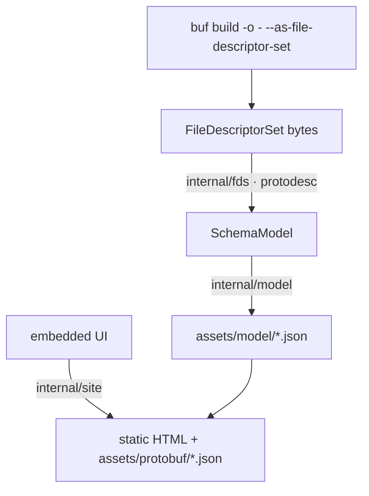

# AGENTS.md

Guidance for coding agents working in this repository. Human-facing product docs live in `README.md`. Every change follows [`QUALITY.md`](QUALITY.md).

## What this is

pbschema-lens is a **static** Protocol Buffers schema explorer. Buf compiles the schema. This repo reads a `FileDescriptorSet`, builds a renderer-independent symbol model in Go, and copies an embedded browser UI that renders that model. There is no documentation server, database, or schema registry.

Do not introduce Starlight, MDX, a runtime docs server, or a path that runs Node, JavaScript, or WebAssembly inside the `pbschema-lens` process. The browser UI is compiled ahead of time and embedded. The Go process does not invoke Buf and does not compile `.proto` files.

## Layout

| Path | Role |
|---|---|
| `cmd/pbschema-lens/main.go` | CLI (`build`, `dev`, `doctor`, `diff`, `init`, `version`) |
| `internal/config/` | `pbschema-lens.yaml` |
| `internal/fds/` | `FileDescriptorSet` read |
| `internal/classify/` | File classification and external-link rules |
| `internal/markdown/` | Comment sanitizer |
| `internal/model/` | `SchemaModel` producer, options, semantic renderers, diff |
| `internal/pipeline/` | Orchestration for `build`, `dev`, and `diff` |
| `internal/site/` | Embed the compiled UI, stamp tokens, write per-symbol JSON |
| `ui/` | Vite browser UI. Compiled into `internal/site/dist` |
| `src/core/` | Display helpers and the TypeScript `SchemaModel` types |
| `site/src/` | Shared CSS and theme imported by `ui/` |
| `examples/acme/` | Bundled demo schema; published to GitHub Pages |
| `examples/github-pages/` | Notes for *other* schema repos using this tool |
| `fixtures/` | Proto fixtures for Go model tests |

During development, run `npm run build:ui` before `go build` or `go run ./cmd/pbschema-lens`. `internal/site` embeds `internal/site/dist` with `//go:embed`.

## Internal architecture

Data flows one way. The browser renders JSON shards under `assets/model/`. It does not call Buf or rebuild the descriptor set.


```mermaid
flowchart TD
  buf["buf build -o - --as-file-descriptor-set"]
  fds["FileDescriptorSet bytes"]
  model["SchemaModel"]
  json["assets/model/*.json"]
  ui["embedded UI"]
  out["static HTML + assets/protobuf/*.json"]

  buf --> fds
  fds -->|"internal/fds · protodesc"| model
  model -->|"internal/model"| json
  ui -->|"internal/site"| out
  json --> out
```

`cmd/pbschema-lens` loads `pbschema-lens.yaml` (`internal/config`) and calls `pipeline.Build`. That is the only orchestration entry point for `build`, `dev`, and `diff`.

### Input

The product reads a `FileDescriptorSet` from a file or from stdin (`-`). It does not shell out to Buf. `--source` attaches `.proto` text for the in-site browser by matching descriptor file names. A descriptor-only build has no source pages.

### Model (`internal/model/`)

`SchemaModel` (`internal/model/types.go`, mirrored by `src/core/types.ts`) is the contract between the Go pipeline and the browser. Every documented entity is a `DocSymbol` in `model.symbols`, with kind-specific lists (`messages`, `services`, …) as indexes into that map.

`Build`:

1. Classifies each file (`internal/classify`) as `local`, `well-known`, `external-documented`, or `external-undocumented`. Only `local` and (non-hidden) WKT get pages / nav. `wellKnownTypes.enabled: false` keeps the well-known domain but sets `generatePage` and `inNav` false for every well-known file, including Timestamp and Duration. Hidden descriptor and feature protos stay unpublished when the flag is omitted or true.
2. Walks the protoreflect file set into packages, files, messages, fields, oneofs, enums, services, methods, and extensions.
3. Extracts custom options generically (`internal/model/options.go`). Semantic renderers in `internal/model/semantic.go` are optional overlays.
4. Sanitizes comments to HTML (`internal/markdown`).
5. Records forward edges and inverts them to `referencedBy`.
6. Builds `symbolIndex`. URL grammar is `internal/model/links.go`. The TypeScript copy in `src/core/urls.ts` stays aligned for tests and display helpers.

`--against` reads a second `FileDescriptorSet` and attaches `model.diff` (`internal/model/diff.go`). Diff is symbol-level. There is no `buf breaking` integration.

A config that lists `plugins` fails the build. The binary does not load plugin modules.

### Site

`internal/site` copies the embedded Vite build into the output directory, stamps `/__PBSCHEMA_BASE__/`, `__DATA_BASE__`, `__SITE_URL__`, `__FULL_TEXT__`, and `__TITLE__`, and copies `index.html` onto every `generatePage` route plus `/explore`, `/graph`, and `/diff`. It writes that same shell to `404.html` so an unknown path still loads the site, and adds `/source` when any source text is present. Search opens from the header on any page and has no route of its own. Site output refuses a filesystem root, the working directory, or an ancestor of the working directory, then replaces that directory with `RemoveAll` and `MkdirAll`. A generated path that is absolute or contains a `..` segment is not written. Model data is split: `assets/model/index.json` (nav, search, package and file cards, shard keys), `assets/model/symbols/<sha256>.json` (one page plus the children it renders), `assets/model/source/<sha256>.json` (proto text), `assets/model/graph.json`, `assets/model/references.json`, and `assets/model/diff.json` when a diff exists. `assets/model/comments.json` is written when full-text search is on. There is no monolithic `model.json`. Every build writes `assets/protobuf/symbols.json` and `build-info.json`. The exported `assets/protobuf/references.json` and `schema.binpb` follow `artifacts.references` and `artifacts.descriptorSet`.

The browser loads `index.json` first, then the payload named by that index. Display helpers (package nav, field table, source tree, search ranking) stay in TypeScript under `src/core/` and run in the browser. Comment search fetches `comments.json` when `search.fullText` is omitted or true. The diff page fetches `diff.json`. There is no Pagefind index. `dev` watches the descriptor file and does not invoke Buf. Repository link commits come from `--commit` or `source.commit`; the process does not run git.

### Where to change what

| Change | Place |
|---|---|
| CLI flags, commands | `cmd/pbschema-lens/main.go` |
| Config schema | `internal/config/config.go` |
| Descriptor ingest | `internal/fds/fds.go` |
| Symbol graph, comments, options | `internal/model/` (`types.go` and `src/core/types.ts` together when the JSON shape changes) |
| HTTP / validation / field-behavior chips | `internal/model/semantic.go` (`google.api.http`, `buf.validate`, `cybozu.validate`, …) |
| Field table grouping and Validation column | `src/core/field-table.ts` + `ui/src/main.ts` |
| Sidebar package tree and home area summary | `src/core/package-nav.ts` + `ui/src/main.ts` |
| Source file tree | `src/core/source-tree.ts` + `ui/src/main.ts` |
| Symbol search ranking | `src/core/search.ts` + `ui/src/main.ts` |
| RPC method URLs | `internal/model/links.go` |
| Page layout, tables, source browser, theme | `ui/src/main.ts`, `site/src/styles/global.css`, `site/src/lib/theme.ts` |
| Example schema | `examples/acme/proto/` |
| Pages workflow template | `pagesWorkflow` in `cmd/pbschema-lens/main.go` |
| GitHub Release binaries | `.goreleaser.yaml` and `.github/workflows/release.yml` (`scripts/release-detect.sh`) |

If you change `SchemaModel`, update the Go producer and the TypeScript type. The JSON under `assets/model/` is the API between them.

## Quality

The quality target, the bar for a finished change, and how to maintain it are in [`QUALITY.md`](QUALITY.md). Follow that file for every change.

## Commands

```bash
npm ci
npm test
npm run typecheck
npm run build:ui
go test ./...
buf build examples/acme -o - --as-file-descriptor-set | go run ./cmd/pbschema-lens doctor --config examples/acme/pbschema-lens.yaml
buf build examples/acme -o - --as-file-descriptor-set | go run ./cmd/pbschema-lens build --config examples/acme/pbschema-lens.yaml --out examples/acme/dist --source examples/acme/proto
```

Root `tsconfig.json` typechecks `src/`. `ui/tsconfig.json` typechecks the browser UI. `engines.node` is `>=24`. TypeScript 7 defaults `types` to `[]`; the root config keeps `compilerOptions.types: ["node"]`.

## Generated output — do not commit

These are gitignored and rewritten on every build:

- `dist/`, `examples/acme/dist/`, `internal/site/dist/`
- `.pbschema-lens/`

`internal/site/dist` is the Vite output that `go build` embeds. CI runs `npm run build:ui` before `go test` and `go build`. The Pages workflow for *this* repo builds `examples/acme` into `dist/` with `--base "/pbschema-lens/"`. Do not commit that output.

## Invariants

- **Comments are untrusted.** The product renders Markdown through the sanitized HTML allowlist in `internal/markdown`. `src/core/markdown.ts` keeps the same allowlist for `escapeHtml` and the vitest suite; move both when the allowlist changes. Never compile proto comments as MDX or JavaScript. Tests in `internal/markdown/markdown_test.go` and `src/core/markdown.test.ts` guard this.
- **Custom options are data, not a hard-coded name list.** Prefer the generic option model; semantic renderers in `internal/model/semantic.go` are additive sugar (`google.api.http`, `buf.validate`, `cybozu.validate`, field behavior, deprecated). Field tables surface `buf.validate` and `cybozu.validate` in a Validation column; Details keeps JSON name, presence, and raw option text.
- **View source** is the in-site proto browser when `.proto` text is available. `source.repository` only adds a separate “View on GitHub” link.
- **Plugins are not loaded.** A non-empty `plugins` list fails the build. Do not load modules from schema comments, option values, or config.
- Descriptor, config, and source paths may contain `..`. Output refuses the filesystem root, the working directory, and ancestors of the working directory, and rejects a generated path that is absolute or contains a `..` segment (`internal/site`).

## GitHub Pages `base`

`base` is the site path, not the hostname:

| Publish mode | Typical URL | `base` |
|---|---|---|
| Public project site | `https://<owner>.github.io/<repo>/` | `/<repo>/` |
| Privately published site | unique `https://<random>.pages.github.io/` | `/` |
| User/org site or custom domain | origin root | `/` |

`pbschema-lens init --github-pages` writes `.github/workflows/protobuf-docs.yml` from the `pagesWorkflow` string in `cmd/pbschema-lens/main.go`. If you change that workflow, edit that string, not a checked-in copy. Keep `examples/github-pages/README.md` in sync. The generated workflow pins each action to a release commit, installs Buf with `buf-action` (`setup_only: true`), downloads `pbschema-lens_linux_amd64.tar.gz` from `releases/latest/download`, and runs `buf build -o - --as-file-descriptor-set | pbschema-lens build --out dist --base "$base" --commit "$GITHUB_SHA"`. It does not pass `--source`.

This repository’s own CI is `.github/workflows/ci.yml` on Node 24 and Go 1.26: display-helper tests, typecheck, `npm run build:ui`, `go test`, doctor, build the Acme example, then deploy Pages from `main` only.

`.github/workflows/release.yml` runs on every push to `main`. `scripts/release-detect.sh` compares `package.json` on HEAD to `HEAD^`. That is enough because `main` only accepts squash merges via PR (no merge commits, no rebase merges, no direct pushes), so each push is one commit. It treats HEAD as a release only when the version changed to a new `x.y.z` and `gh release view vX.Y.Z` does not already exist. Then the job tests, builds the UI, runs `go test`, creates annotated tag `vX.Y.Z` on `$GITHUB_SHA` (or fails if that tag already points at a different commit), pushes it, and runs `goreleaser/goreleaser-action` (`release --clean`) from `.goreleaser.yaml`. GoReleaser publishes `CGO_ENABLED=0` binaries for Linux, Windows, and macOS on amd64 and arm64. Archive names are `pbschema-lens_<os>_<arch>.tar.gz` (`.zip` on Windows). Those live at `/releases/download/…`, not GitHub’s `/archive/refs/tags/…` source snapshot. Do not add a `prepare` script. Document consumer install as a pinned `/releases/download/vX.Y.Z/pbschema-lens_<os>_<arch>.tar.gz`.

A `GITHUB_TOKEN` tag push does not start another workflow, so tagging and publishing stay in this one job. Do not keep a tag-push trigger. Do not set GoReleaser `release.mode: replace`; published releases stay immutable.

## Releasing

Do not run `gh release create`, `git tag`, or attach assets by hand.

1. Open a PR that sets the same new version in `package.json`, `package-lock.json`, `cmd/pbschema-lens/main.go` (`var version`), and the README install URL. The tag is `vX.Y.Z`. GoReleaser passes that tag into `-X main.version`. The string in `main.go` is the version reported by source builds.
2. Merge the PR to `main`. The **Release binaries** workflow tags that merge commit and publishes.
3. Ordinary `main` pushes (docs, features, this workflow itself) do not change `package.json` version, so they skip.

Do not delete a published tag or Release. This repo uses immutable releases: a deleted tag name cannot be reused (that is why `v0.2.0` was skipped). If the version on `main` is wrong, bump to the next patch in a new PR. Do not move a published tag to a later commit.
