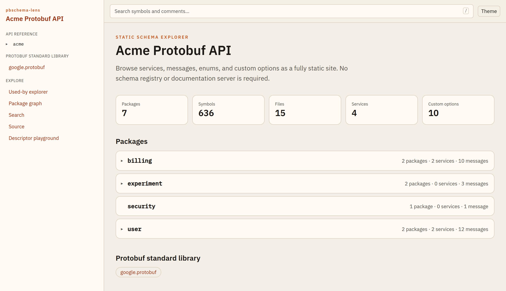

# pbschema-lens

[](https://github.com/ymmt2005/pbschema-lens/actions/workflows/ci.yml)

An open-source **static schema explorer for Protocol Buffers**.

Point it at a Buf workspace, a directory of `.proto` files, or a `FileDescriptorSet`, and it produces a static site you can host on GitHub Pages (or anywhere else). There is no documentation server, no database, and no hosted schema registry.

The generated site is a graph over the schema: services, RPCs, messages, fields, enums, extensions, custom options, well-known types, reverse "used by" references, and two-layer search.

A live build of the bundled [`examples/acme`](examples/acme) API is on [GitHub Pages](https://ymmt2005.github.io/pbschema-lens/):

<p align="center">
  <a href="https://ymmt2005.github.io/pbschema-lens/">
    
  </a>
</p>

## Quick start

```bash
npm install
npx tsx src/cli.ts build examples/acme --out examples/acme/dist
```

Then open `examples/acme/dist/index.html`, or serve it:

```bash
npx tsx src/cli.ts dev examples/acme --port 43147
```

Against an existing descriptor set:

```bash
npx tsx src/cli.ts build schema.binpb --out dist
```

## Install from a GitHub Release

This is a build-time CLI, not a library. It requires **Node 24+**. Prefer a pinned download over a `package.json` dependency.

Each GitHub Release **Assets** list includes an `npm pack` tarball we attach after `tsc`. That file already contains compiled `dist/` (no install scripts). Download it from `/releases/download/…`:

```bash
curl -fsSL -o pbschema-lens.tgz \
  https://github.com/ymmt2005/pbschema-lens/releases/download/v0.2.0/pbschema-lens-0.2.0.tgz
npm install --no-save ./pbschema-lens.tgz
npx pbschema-lens build .
```

The same page also shows **Source code (tar.gz)** and **Source code (zip)**. Those are not our pack. GitHub always adds them when a tag exists: they are a snapshot of the git tree (`/archive/refs/tags/v0.2.0.tar.gz`), TypeScript sources only. The CLI bin is `./dist/cli.js`, so installing that archive does not give you a working `pbschema-lens`. Use the Assets file named `pbschema-lens-0.2.0.tgz`.

A stable name `pbschema-lens.tgz` is also uploaded for `releases/latest/download/pbschema-lens.tgz`. Pin a versioned URL when you care about reproducibility. Pushing a semver tag (`v0.2.0`) creates the GitHub Release and attaches both pack files.

## CLI

| Command | Purpose |
|---|---|
| `pbschema-lens build [input]` | Compile the schema and emit a static site |
| `pbschema-lens dev [input]` | Rebuild on proto changes and preview locally |
| `pbschema-lens doctor [input]` | Check Buf, compilation, options, and source-link config |
| `pbschema-lens diff --against <file>` | Compare two schemas and attach a diff page |
| `pbschema-lens init [--github-pages]` | Write `pbschema-lens.yaml` and an optional Pages workflow |

`input` can be:

- a Buf module / workspace (`buf.yaml`)
- a directory of `.proto` files
- a `FileDescriptorSet` (`*.binpb`, `*.pb`, `*.desc`)

## Configuration

`pbschema-lens.yaml`:

```yaml
title: "Acme Protobuf API"
input: "."
output: "dist"
base: "/"            # public project Pages: "/repo-name/"; private Pages and custom domains: "/"

# Optional. Adds a separate "View on GitHub" link.
# View source always uses the embedded browser when .proto files are present.
source:
  repository: "github:org/repo"

documentation:
  include:
    - "acme/**"
  exclude:
    - "third_party/**"

search:
  symbolIndex: true
  fullText: true

sourceBrowser:
  enabled: true

artifacts:
  descriptorSet: false
  symbolIndex: true

externalLinks:
  - package: "acme.identity.**"
    urlTemplate: "https://docs.example.com/identity/reference/{symbol}"
```

Every important flag also has a CLI equivalent (`--out`, `--base`, `--title`, `--against`).

## What the site includes

- Package, service, RPC, message, field, oneof, enum, and extension pages
- Arbitrary custom options, including definition pages and usage backlinks
- Built-in documentation for Protocol Buffers well-known types
- Forward links and reverse "Used by" references
- Editions effective-feature display
- Specialized renderers for `google.api.http`, `buf.validate`, `cybozu.validate`, field behavior, and `deprecated`
- Field tables show `buf.validate` and `cybozu.validate` rules in a dedicated Validation column
- Symbol search (exact / prefix / fuzzy) plus Pagefind full-text search
- Optional embedded source browser
- Schema diff + `buf breaking` integration when `--against` is set
- Browser-local descriptor playground (no upload)
- Machine-readable `assets/protobuf/*.json` artifacts

## Architecture

Compilation is Buf's job. pbschema-lens consumes `google.protobuf.FileDescriptorSet`, builds a renderer-independent symbol model with Protobuf-ES, then emits an Astro static site. Starlight is not used: pages are generated from the model via `getStaticPaths()`, not from markdown files.

Comments are treated as untrusted data. They are rendered as Markdown with a sanitized HTML allowlist. They are never compiled as MDX or JavaScript.

## Security notes

- A private Git repository does **not** make a published static site private.
- Plugins run as trusted build code.
- Source paths are rejected if they contain `..`.

## Develop

```bash
npm test
npx tsc -p tsconfig.json --noEmit
npx tsx src/cli.ts doctor examples/acme
```

The example API lives in `examples/acme` and is published to [GitHub Pages](https://ymmt2005.github.io/pbschema-lens/) after CI tests pass. The `pbschema-lens init --github-pages` template is documented in `examples/github-pages`.
