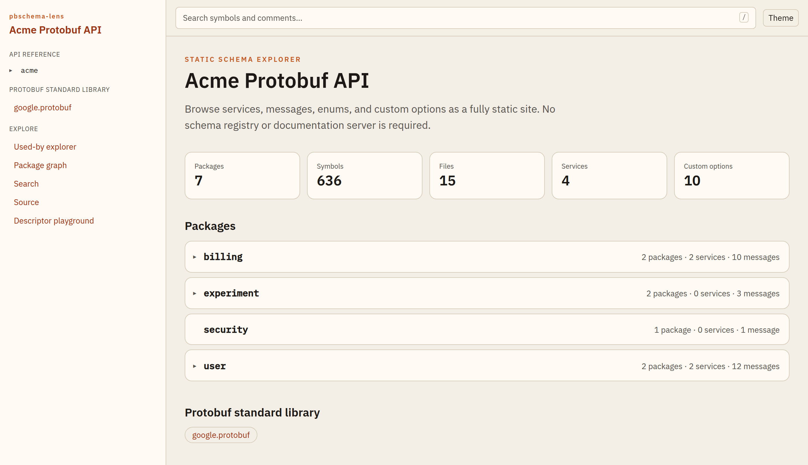

# pbschema-lens

[](https://github.com/ymmt2005/pbschema-lens/actions/workflows/ci.yml)

pbschema-lens is an open-source **static schema explorer** for Protocol Buffers. Pipe a Buf `FileDescriptorSet` into the binary and it writes a static site you can host on GitHub Pages, or anywhere else.

The generated site is a graph over the schema: services, RPCs, messages, fields, enums, extensions, custom options, well-known types, reverse "used by" references, and two-layer search.

A live build of the bundled [`examples/acme`](examples/acme) API is on [GitHub Pages](https://ymmt2005.github.io/pbschema-lens/):

<p align="center">
  <a href="https://ymmt2005.github.io/pbschema-lens/">
    
  </a>
</p>

## Quick start

Compile the schema with Buf, then pipe the descriptor set into pbschema-lens. The binary does not invoke Buf.

```bash
buf build -o - --as-file-descriptor-set \
  | pbschema-lens build --out dist --source proto
```

`--source` is the directory of `.proto` files used for the in-site source browser. Omit it when you only have a descriptor set. The tool does not look for a `proto` directory on its own.

Pages are client-rendered shells that fetch JSON, so open the site over HTTP. `dev` watches the descriptor file and serves the site. It does not invoke Buf.

```bash
buf build -o schema.binpb --as-file-descriptor-set
pbschema-lens dev schema.binpb --out dist --port 43147
```

A static file server works the same way. Opening `dist/index.html` as a local file does not, because the browser blocks those fetches.

## Install from a GitHub Release

This is a build-time CLI, not a library. Download a static binary for Linux, Windows, or macOS (amd64 or arm64).

```bash
curl -fsSL -o pbschema-lens.tar.gz \
  https://github.com/ymmt2005/pbschema-lens/releases/download/v0.6.1/pbschema-lens_linux_amd64.tar.gz
tar -xzf pbschema-lens.tar.gz
sudo mv pbschema-lens /usr/local/bin/pbschema-lens
```

`releases/latest/download/pbschema-lens_linux_amd64.tar.gz` is the same asset for the newest release. Pin a versioned URL when you care about reproducibility. Windows archives are `.zip` and the binary is `pbschema-lens.exe`. Other platform names follow `pbschema-lens_<os>_<arch>`.

This repository uses GitHub [immutable releases](https://docs.github.com/en/code-security/concepts/supply-chain-security/immutable-releases): once a Release is published, its Git tag and attached assets cannot be changed or replaced.

The same page also shows **Source code (tar.gz)** and **Source code (zip)**. Those are not the CLI. GitHub always adds them when a tag exists. Use the GoReleaser asset for your OS and architecture.

## CLI

| Command | Purpose |
|---|---|
| `pbschema-lens build [descriptor]` | Read a FileDescriptorSet and emit a static site |
| `pbschema-lens dev [descriptor]` | Rebuild when the descriptor file changes and preview locally |
| `pbschema-lens doctor [descriptor]` | Check the descriptor set, options, and source-link config |
| `pbschema-lens diff [descriptor] --against <file>` | Compare two descriptor sets and attach a diff page |
| `pbschema-lens init [--github-pages]` | Write `pbschema-lens.yaml` and an optional Pages workflow |

`descriptor` is a `FileDescriptorSet` (`*.binpb`, `*.pb`, `*.desc`) or `-` for stdin. `dev` needs a file, because stdin cannot be watched. Pass `--source <dir>` when `.proto` text should appear in the site.

| Flag | Commands | Effect |
|---|---|---|
| `-o`, `--out` | `build`, `dev`, `diff` | Output directory. Overrides `output`. |
| `--base` | `build`, `dev`, `diff` | URL path prefix. Overrides `base`. |
| `--title` | `build`, `dev`, `diff` | Site title. Overrides `title`. |
| `-c`, `--config` | `build`, `dev`, `diff`, `doctor` | Config file. |
| `--source` | `build`, `dev`, `diff` | Directory of `.proto` files for the source browser. |
| `--commit` | `build`, `dev`, `diff` | Commit for repository links. Overrides `source.commit`. |
| `--against` | `build`, `diff` | FileDescriptorSet to compare. Required for `diff`. |
| `--port` | `dev` | Listen port. Default `43147`. |

A flag that a command does not declare is an error. Each command accepts at most one descriptor path. `pbschema-lens <command> --help` prints that command's usage. Pass `"$(git rev-parse HEAD)"` or `$GITHUB_SHA` to `--commit` when you want a real revision. The binary does not run git.

## Configuration

The config file is `pbschema-lens.yaml` or `pbschema-lens.yml`. With a descriptor path and no `--config`, pbschema-lens looks beside that file, then in the working directory. `--config` and `-c` select a file explicitly.

A relative `input` is resolved from the directory that contains the config file. A descriptor argument, `--source`, `--against`, and `--out` are resolved from the working directory.

```yaml
title: "Acme Protobuf API"
input: "-"
output: "dist"
base: "/"
siteUrl: "https://docs.example.com"

source:
  repository: "github:org/repo"
  commit: "abc123"
  urlTemplate: "https://src.example/{commit}/{file}#L{line}"

documentation:
  include:
    - "acme/**"
  exclude:
    - "third_party/**"

wellKnownTypes:
  enabled: true

search:
  fullText: true

sourceBrowser:
  enabled: true

artifacts:
  descriptorSet: false
  references: true

externalLinks:
  - package: "acme.identity.**"
    urlTemplate: "https://docs.example.com/identity/reference/{symbol}"
```

| Key | Default | Effect |
|---|---|---|
| `title` | `Protobuf API` | Site title. `build`, `dev`, and `diff` accept `--title`. |
| `input` | `-` | FileDescriptorSet path, or `-` for stdin. A relative path is resolved from the config file's directory. The command's `[descriptor]` argument overrides this and is resolved from the working directory. |
| `output` | `dist` | Output directory. Those commands accept `--out`. |
| `base` | `/` | Path prefix for the site. A public GitHub project site uses `/<repo>/`. A private Pages site, a user or org site, or a custom domain uses `/`. Those commands accept `--base`. |
| `siteUrl` | omitted | Origin of the published site, such as `https://docs.example.com`. The build emits a canonical link for each page. With `base: /docs/`, the home page canonical URL is `https://docs.example.com/docs/`. |
| `source.repository` | omitted | Repository for the separate “View on GitHub” or “View on GitLab” link. `github:owner/repo` and `https://github.com/owner/repo` (optional `.git`) build a GitHub blob URL. `gitlab:group/project` and `https://gitlab.com/group/project` build a GitLab blob URL. When `.proto` text is available, View source stays in the site and this link is separate. When it is not, View source uses this URL. |
| `source.commit` | omitted | Commit used in repository links. `--commit` overrides this. When both are omitted, links use the literal `HEAD`. pbschema-lens does not run git. |
| `source.urlTemplate` | omitted | Repository link template. When set, this string is used instead of `source.repository`. `{file}` is the proto path, `{line}` is the line number, and `{commit}` is `--commit`, then `source.commit`, then the literal `HEAD`. Example: `https://src.example/{commit}/{file}#L{line}`. |
| `documentation.include` | omitted | Proto path globs or package names. A package pattern ending in `.**` includes nested packages. A non-empty list documents only matching files. Other files have no page and do not appear in symbol search. |
| `documentation.exclude` | omitted | Proto path globs or package names. Matching files are left out of the site: no page, no source, no symbol-search hit, and no link to or from their symbols. A message that uses an option from an excluded file still shows that option chip, without a definition link. |
| `wellKnownTypes.enabled` | `true` | `false` drops every well-known type page and nav entry, including Timestamp and Duration. Descriptor and feature protos stay hidden either way. A field of that type keeps the type name as text. |
| `search.fullText` | `true` | `false` skips comment-text search and does not write `assets/model/comments.json`. Symbol search (exact, prefix, and fuzzy) always runs. |
| `sourceBrowser.enabled` | `true` | `false` does not load `.proto` text, so the site has no source pages. |
| `artifacts.descriptorSet` | `false` | `true` writes `assets/protobuf/schema.binpb`. |
| `artifacts.references` | `true` | `false` skips the exported `assets/protobuf/references.json`. The explorer always reads `assets/model/references.json`. `symbols.json` and `build-info.json` are written on every build. |
| `externalLinks` | omitted | Rules that send a package to another site. `package` is a name or a `.**` pattern. A match is documented externally: no local page, and links use `urlTemplate`. `{symbol}` is the full name, `{kind}` is the symbol kind, and `{package}` is the package. |

## What the site includes

- Package, service, RPC, message, field, oneof, enum, and extension pages
- Arbitrary custom options, including definition pages and usage backlinks
- Built-in documentation for Protocol Buffers well-known types
- Forward links and reverse "Used by" references
- Editions effective-feature display
- Specialized renderers for `google.api.http`, `buf.validate`, `cybozu.validate`, field behavior, and `deprecated`
- Field tables show `buf.validate` and `cybozu.validate` rules in a dedicated Validation column
- Symbol search (exact / prefix / fuzzy) plus in-browser comment search
- Optional embedded source browser when `--source` is passed
- Schema diff when `--against` is a second FileDescriptorSet
- Machine-readable `assets/protobuf/*.json` artifacts

## Architecture

Compilation is Buf's job. pbschema-lens reads a `FileDescriptorSet`, builds the symbol model in Go, and copies an embedded browser UI. The Go process does not run Node, JavaScript, or WebAssembly, and it does not invoke Buf. Starlight is not used.

The site does not ship one `model.json`. `assets/model/index.json` is the nav and search catalog. Each symbol page fetches `assets/model/symbols/<shard>.json`, and each source file fetches `assets/model/source/<shard>.json`. Those shard names are SHA-256 keys stored in the index. The package graph, comment text, schema diff, and reference list are separate files, loaded when those views run.

Comments are treated as untrusted data. Go renders them as Markdown with a sanitized HTML allowlist before they are written into those JSON files. They are never compiled as MDX or JavaScript. Safe links are `http`, `https`, `mailto`, relative paths, and `#fragment`. `javascript:`, `data:`, and protocol-relative `//host` links are dropped.

## Security notes

The security target is current practice for a static site built from untrusted schema text. When a sanitizer bypass or a new HTML, URL, or path sink becomes known, the allowlist and its tests move with it. The full bar is [`QUALITY.md`](QUALITY.md).

- A private Git repository does **not** make a published static site private.
- A config that lists plugins fails the build. The binary does not load modules.
- Descriptor, config, and source paths may contain `..`. Output is refused when it is the filesystem root, the working directory, or an ancestor of the working directory. A generated path that is absolute or contains a `..` segment is not written.

## Develop

The released binary does not require Node. Building this repository from source needs Node to compile `internal/site/dist` before `go build`, and Go 1.26 or newer.

```bash
npm test
npm run typecheck
npm run build:ui
go test ./...
buf build examples/acme -o - --as-file-descriptor-set | go run ./cmd/pbschema-lens doctor --config examples/acme/pbschema-lens.yaml
```

The example API lives in `examples/acme` and is published to [GitHub Pages](https://ymmt2005.github.io/pbschema-lens/) after CI tests pass. The `pbschema-lens init --github-pages` template is documented in `examples/github-pages`.

To cut a GitHub Release, bump the version in a PR (`package.json`, the lockfile, `cmd/pbschema-lens/main.go` `version`, and the install URL) and squash-merge it to `main`. The **Release binaries** workflow sees that squash commit’s `package.json` version change, tags `vX.Y.Z`, and publishes Linux, Windows, and macOS binaries for amd64 and arm64 with GoReleaser. Do not create the tag or the Release by hand. Do not delete a published tag or Release: GitHub will not let you reuse that tag name. If the version is wrong, bump to the next patch and merge that.
